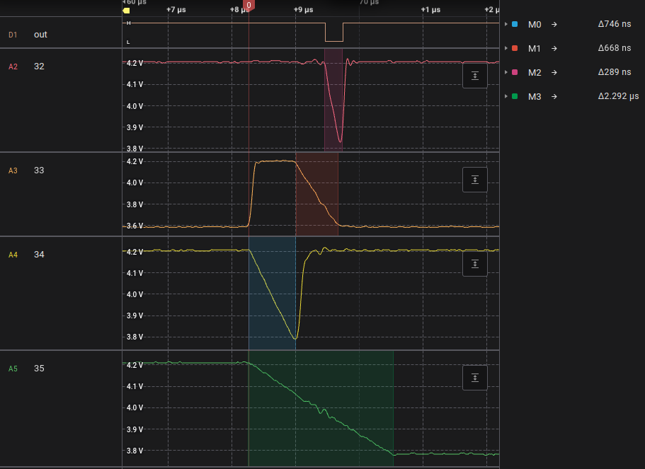

# 10206-501 "SSI296", 10206-002 Read channel and write amplifier

These devices incorporate both the read channel and the write amplifier circuitry.

The 10206-501 comes in the 44-pin PLCC package while the 10206-002 comes in the 40-pin DIP package.

## Pin Description

| PLCC Pin | DIP Pin | Name  | Direction | Description                                     |
|----------|---------|-------|-----------|-------------------------------------------------|
| 44       | 40      |  12V  | Power In  | 12V power rail. |
| 29       | 27      |  5V   | Power In  | 5V power rail. |
| 5, 30    | 5, 26   | GND   | Ground    | Connect to ground. |
| 28       | 28      | GND   | Ground    | Connect to ground. |
| 15       | 13      | WRT\_OK | Input   | Write OK input. Assert when seek completed, ready, and drive selected. |
| 16       | 14      | WRITE\_CUR |      | Write current set point. |
| 19       | 17      | WDO+  | Output    | Data out to the head steering matrix (positive) |
| 20       | 16      | WDO-  | Output    | Data out to the head steering matrix (negative) |
| 22       | 20      | WDATA\_IN+ | Input | Write data in (positive) |
| 23       | 19      | WDATA\_IN- | Input | Write data in (negative) |
| 37       | 35      | WRT\_GATE# | Input | Active low write enable. Connect to MFM bus. |
| 39       | 36      | WRT\_FAULT# | Output | Active low write fault indicator. Asserted if a fault occurs during a write, may deassert during reads. |
| 40       | 37      | DC\_UNSAFE# | Output | Active low DC unsafe indicator. Asserts if 5V or 12V rail fall below minimum thresholds. |
| 42       | 38      | VHS   | Input     | Voltage Head Safe. Monitoring connection to the head steering matrix. |
| 43       | 39      | VCTAP | Output    | Voltage Center Tap. Head center tap driver; driven to 12V during a write and about 5.3V during a read. |
| 1        | 1       | DI+   | Input     | Preamp signal input (positive). |
| 2        | 2       | DI-   | Input     | Preamp signal input (negative). |
| 3        | 3       | -GAIN |           | Preamp gain pin 1. |
| 4        | 4       | +GAIN |           | Preamp gain pin 2. |
| 8        | 7       | DO+   | Output    | Preamp signal output (positive). |
| 9        | 8       | DO-   | Output    | Preamp signal output (negative). |
| 10       | 9       | +C1   | Input     | Signal comparator input 1+. |
| 11       | 10      | -C1   | Input     | Signal comparator input 1-. |
| 12       | 11      | +C2   | Input     | Signal comparator input 2+. |
| 13       | 12      | -C2   | Input     | Signal comparator input 2-. |
| 21       | 18      | DRV\_SEL | Input  | Active low drive select input. Enables the read channel differential outputs. |
| 24       | 21      | +RDO  | O.C.      | Single-ended open-collector read data output. |
| 25       | 22      | +RD   | Output    | Digital data output (positive). |
| 26       | 23      | -RD   | Output    | Digital data output (negative). |
| 31       | 29      | OA    |           | Digital data output amplitude control. Pull up for max or connect a resistor to ground to set another level. |
| 32       | 30      | TMG4  |           | One-shot timer RC pin. Controls the width of the output pulse on RD for a detected flux transition. |
| 33       | 31      | TMG3  |           | One-shot timer RC pin. Edge delay 2b. Triggered by edge delay 2. |
| 34       | 32      | TMG2  |           | One-shot timer RC pin. Edge delay 2. Triggered by input comparator on pins 12 and 13. |
| 35       | 33      | TMG1  |           | One-shot timer RC pin. Edge delay 1. Triggered by input comparator on pins 10 and 11. |
| 6, 7, 14, 17, 18, 27, 36, 38, 41 | 6, 15, 24, 25, 34 | NC | No connect | Not connected. |

## Detailed Description

The write drive circuit takes differential digital data from the WDATA\_IN pins and outputs it (with a current set by the WRITE\_CUR pin) on the WDO pins during write mode. Write mode is entered when DC\_UNSAFE# is deasserted, WRT\_OK is asserted, and WRT\_GATE# is asserted (DRV\_SEL# is ignored).

Voltage Head Safe (VHS) senses when the average center tap voltage of the heads exceeds a limit of about 3.5V, and when this happens, WRT\_FAULT# asserts, because this indicates that multiple heads have been selected. If the voltage is below some minimum threshold (indicated that no heads are selected) it may also trigger a write fault.

VCTAP is driven to 12V in write mode and otherwise goes to 5.3V (for reads). It is controlled by WRT\_GATE# alone, for some reason. This drives the center tap voltage of the currently-selected head.

The power supply monitor asserts DC\_UNSAFE# when the 5V rail falls below 4.2V (rising threshold is 4.23) or when the 12V rail falls below 9.54V (rising threshold is 9.67V).

The preamp section is very similar to the NE592. A RLC network is typically connected across the gain terminals to provide a bandpass filter characteristic. This shapes the differentiated signal coming from the head preamp (located in the head matrix IC).

Typically the circuit on the drive logic board splits this diffential output signal into two sets of signals with different filters applied. Each set of signals has a differential comparator input that each drives a one-shot timer.

Comparator C1 drives one-shot TMG1. Comparator C2 drives one-shot TMG2, and TMG2 drives TMG3. In order to generate an output pulse, the logic is not well understood but it seems that comparator C1 must trigger after comparator C2 (due to an external phase shift network).

If the conditions are met to generate an output pulse, the fourth one-shot trigger, TMG4, triggers for its fixed pulse width time.

Each one-shot pin works in stages:

1. The pin is pulled up to (mostly) 5V. This discharges the timing capacitor tied between the pin and 5V.
2. The pin is released and allowed to discharge through the external pulldown resistor to 90% of 5V. This triggers the output of the one-shot. By using the narrow threshold (only 10% of the total RC curve) the timing result is approximately linear.
3. Some pins discharge the timing capacitor again to 5V, others hover at the 90% of 5V mark.

The timing value can be approximated as T = 0.1 * R * C.

In the scope shot above, all the pins have had 10K resistors installed and the following capacitor values

* Pin 32: 270pF
* Pin 33: 470pF
* Pin 34: 680pF
* Pin 35: 2200pF

These are much larger than the usual values used by the hard drive, which is typically 47pF, to make the scope shot easier to interpret.

Typical values (on the ST-251) are:

* TMG1: 82ns - comparator C1
* TMG2: 47ns
* TMG3: 69ns - total time for comparator C2 is 116ns
* TMG4: 42ns - output data pulse width

